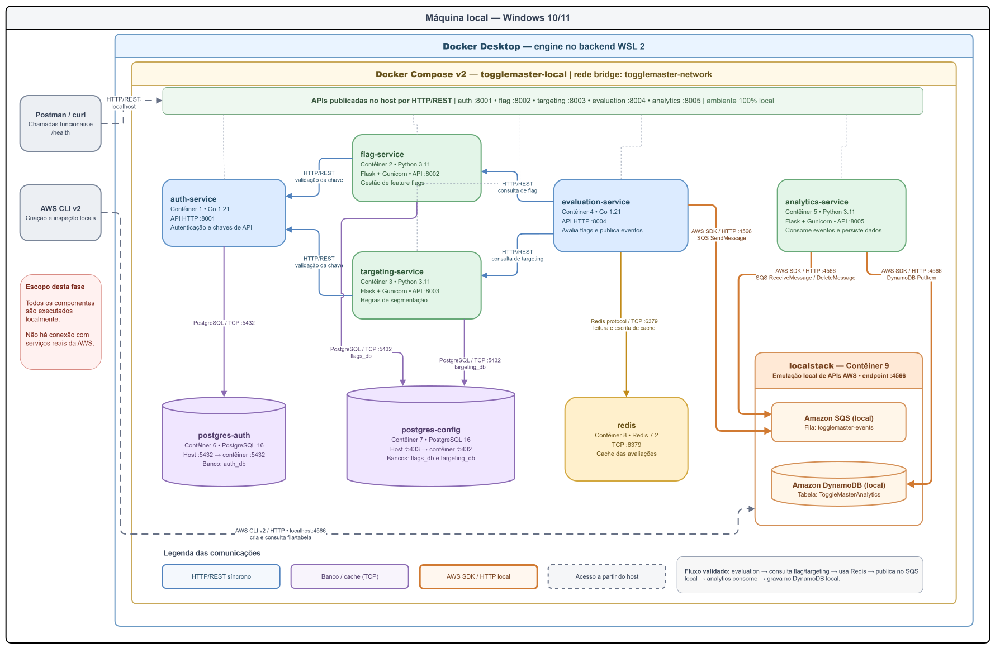

# ToggleMaster — Tech Challenge Fase 2

O ToggleMaster é uma plataforma de feature flags composta por cinco
microsserviços. Este repositório contém o ambiente integrado já validado
localmente com Docker Compose e Kubernetes via kind, sem utilizar recursos ou
credenciais reais da AWS.

## Estado atual

- [x] cinco microsserviços empacotados com Dockerfiles multistage;
- [x] ambiente com nove contêineres validado via Docker Compose;
- [x] SQS e DynamoDB simulados pelo LocalStack;
- [x] fluxo `evaluation -> SQS -> analytics -> DynamoDB` validado;
- [x] manifests Kubernetes base validados em cluster kind;
- [x] Secret Kubernetes real mantido fora do Git;
- [x] HPA e KEDA: testes de carga e escalabilidade positivos;
- [x] implantação na AWS: já realizado.

## Arquitetura



Fluxo principal:

1. O cliente consulta o `evaluation-service`.
2. O serviço busca flags e regras nos serviços `flag` e `targeting` e utiliza
   Redis como cache.
3. A avaliação é enviada para uma fila SQS no LocalStack.
4. O `analytics-service` consome a mensagem e grava o evento no DynamoDB do
   LocalStack.

| Componente | Responsabilidade | Porta local |
|---|---|---:|
| `auth-service` | Criação e validação de chaves de API | 8001 |
| `flag-service` | CRUD de feature flags | 8002 |
| `targeting-service` | Regras de segmentação | 8003 |
| `evaluation-service` | Avaliação de flags e publicação de eventos | 8004 |
| `analytics-service` | Consumo da fila e persistência de eventos | 8005 |
| PostgreSQL auth | Chaves de API | 5432 |
| PostgreSQL config | Bancos `flags_db` e `targeting_db` | 5433 |
| Redis | Cache das avaliações | 6379 |
| LocalStack | SQS e DynamoDB locais | 4566 |

## Estrutura do repositório

```text
.
├── analytics-service/
├── auth-service/
├── evaluation-service/
├── flag-service/
├── targeting-service/
├── infra/
│   └── postgres-config/       # Inicialização dos bancos compartilhados
├── k8s/
│   ├── base/                  # Ambiente Kubernetes funcional
│   ├── autoscaling/           # HPA e KEDA, aplicados separadamente
│   ├── secrets/               # Apenas o modelo versionado
│   └── README.md              # Procedimento Kubernetes detalhado
├── docs/                      # Diagramas e relatório
├── docker-compose.yaml
├── .env.example
└── README.md
```

Os scripts em `auth-service/db`, `flag-service/db`, `targeting-service/db` e
`infra/postgres-config` são utilizados pelo Docker Compose e não devem ser
removidos.

## Pré-requisitos

- Windows com WSL 2;
- Docker Desktop usando contêineres Linux;
- Docker Compose v2;
- Git;
- `curl` ou Postman;
- AWS CLI v2 para manipular o LocalStack pelo host;
- `kubectl` e kind para a execução Kubernetes;
- Helm apenas para a etapa posterior de autoscaling.

### Validar as ferramentas

```bat
wsl --version
docker --version
docker compose version
git --version
curl --version
aws --version
kubectl version --client
kind version
helm version
```

Go e Python não precisam estar instalados no host. A compilação ocorre dentro
das imagens Docker.

## Opção A — Docker Compose

É o caminho mais curto para validar o fluxo completo.

### 1. Preparar as variáveis

```bat
copy .env.example .env
notepad .env
```

Use senhas locais formadas por letras ASCII, números, hífen ou underscore.
Caracteres acentuados e caracteres reservados de URL, como `@`, `:`, `/`, `#`,
`%` e `?`, podem invalidar as URLs de conexão com PostgreSQL.

O arquivo `.env` está ignorado pelo Git.

### 2. Iniciar o ambiente

```bat
docker compose up -d --build
docker compose ps
```

### 3. Criar a fila e a tabela locais

```bat
set AWS_ACCESS_KEY_ID=test
set AWS_SECRET_ACCESS_KEY=test
set AWS_DEFAULT_REGION=us-east-1

aws sqs create-queue --queue-name togglemaster-events --endpoint-url http://localhost:4566

aws dynamodb create-table --table-name ToggleMasterAnalytics --attribute-definitions AttributeName=event_id,AttributeType=S --key-schema AttributeName=event_id,KeyType=HASH --billing-mode PAY_PER_REQUEST --endpoint-url http://localhost:4566
```

Essas credenciais são fictícias e são usadas somente pelo LocalStack.

### 4. Validar os serviços

```bat
curl http://localhost:8001/health
curl http://localhost:8002/health
curl http://localhost:8003/health
curl http://localhost:8004/health
curl http://localhost:8005/health
```

Todos devem retornar `{"status":"ok"}`.

## Opção B — Kubernetes local com kind

O procedimento completo está em [`k8s/README.md`](k8s/README.md). O resumo para
uma instalação limpa é apresentado abaixo.

### 1. Criar o cluster

Neste projeto foi utilizado Kubernetes `1.31.6`, compatível com ambientes que
ainda apresentam `CgroupVersion=1` no Docker Desktop:

```bat
kind create cluster --name togglemaster --image kindest/node:v1.31.6@sha256:28b7cbb993dfe093c76641a0c95807637213c9109b761f1d422c2400e22b8e87 --wait 5m

kubectl config current-context
kubectl get nodes
```

O contexto esperado é `kind-togglemaster` e o node deve estar `Ready`.

### 2. Construir e carregar as imagens

```bat
docker compose build

kind load docker-image ^
  togglemaster/auth-service:local ^
  togglemaster/flag-service:local ^
  togglemaster/targeting-service:local ^
  togglemaster/evaluation-service:local ^
  togglemaster/analytics-service:local ^
  --name togglemaster
```

### 3. Criar o Secret local

```bat
copy k8s\secrets\togglemaster-secrets.example.yaml k8s\secrets\togglemaster-secrets.yaml
notepad k8s\secrets\togglemaster-secrets.yaml
```

Substitua os valores de exemplo. O arquivo sem `.example` está no `.gitignore`
e nunca deve ser versionado.

### 4. Aplicar a base

```bat
kubectl apply -f k8s\base\namespace.yaml
kubectl apply -f k8s\secrets\togglemaster-secrets.yaml
kubectl apply -k k8s\base

kubectl wait -n togglemaster --for=condition=complete job/localstack-bootstrap --timeout=10m
kubectl get pods -n togglemaster
```

São esperados nove Pods de longa duração em `Running` e o Job
`localstack-bootstrap` em `Completed`.

### 5. Expor as APIs

Mantenha os comandos em terminais separados:

```bat
kubectl port-forward -n togglemaster service/auth-service 8001:8001
kubectl port-forward -n togglemaster service/flag-service 8002:8002
kubectl port-forward -n togglemaster service/targeting-service 8003:8003
kubectl port-forward -n togglemaster service/evaluation-service 8004:8004
kubectl port-forward -n togglemaster service/analytics-service 8005:8005
```

## Validar o fluxo ponta a ponta

Os comandos abaixo funcionam tanto no Compose quanto no Kubernetes após os
port-forwards.

### 1. Criar a chave interna

```bat
curl -X POST http://localhost:8001/admin/keys ^
  -H "Content-Type: application/json" ^
  -H "Authorization: Bearer SUA_MASTER_KEY" ^
  -d "{\"name\":\"evaluation-service\"}"
```

Copie a chave retornada para `SERVICE_API_KEY`:

- no Compose, atualize `.env` e recrie o `evaluation-service`:

  ```bat
  docker compose up -d --force-recreate evaluation-service
  ```

- no Kubernetes, atualize `k8s/secrets/togglemaster-secrets.yaml`, reaplique o
  Secret e reinicie o Deployment.

```bat
kubectl apply -f k8s\secrets\togglemaster-secrets.yaml
kubectl rollout restart deployment/evaluation-service -n togglemaster
kubectl rollout status deployment/evaluation-service -n togglemaster
```

### 2. Criar uma flag

```bat
curl -X POST http://localhost:8002/flags ^
  -H "Content-Type: application/json" ^
  -H "Authorization: Bearer SUA_SERVICE_API_KEY" ^
  -d "{\"name\":\"checkout_novo\",\"description\":\"Teste do fluxo\",\"is_enabled\":true}"
```

### 3. Avaliar a flag

```bat
curl "http://localhost:8004/evaluate?user_id=lucas-001&flag_name=checkout_novo"
```

### 4. Confirmar a persistência

No Compose:

```bat
aws dynamodb scan --table-name ToggleMasterAnalytics --endpoint-url http://localhost:4566
```

No Kubernetes:

```bat
kubectl exec -n togglemaster deployment/localstack -- awslocal dynamodb scan --table-name ToggleMasterAnalytics
```

O registro deve conter `event_id`, `user_id`, `flag_name`, `result` e
`timestamp`.

## Diagnóstico rápido

| Sintoma | Causa provável | Correção |
|---|---|---|
| `kubelet is configured to not run on a host using cgroup v1` | Kubernetes 1.35 ou superior não aceita cgroup v1 | Use a imagem kind `v1.31.6` indicada neste README ou migre o Docker para cgroup v2 |
| `invalid userinfo` na `DATABASE_URL` | Senha contém acento ou caractere reservado | Use senha ASCII com letras, números, `-` ou `_` |
| `password authentication failed` | Secret e senha persistida no PostgreSQL são diferentes | Alinhe a senha do usuário PostgreSQL com o Secret ou recrie o volume local |
| `pkg_resources` ausente | Imagem Python sem versão compatível do setuptools | Mantenha `setuptools==80.9.0` no build e reconstrua a imagem |
| `flags_db` ou `targeting_db` não existe | Volume foi criado antes dos scripts SQL | Recrie o volume em ambiente descartável ou aplique os scripts manualmente |
| `InvalidClientTokenId` | SDK tentou acessar a AWS real | Confirme `AWS_ENDPOINT_URL=http://localstack:4566` dentro dos containers |

## Autoscaling

Os manifests de HPA e KEDA estão separados de propósito. Não os aplique antes
de instalar Metrics Server e KEDA:

```bat
kubectl apply -k k8s\autoscaling
```

Veja os comandos de instalação e validação em [`k8s/README.md`](k8s/README.md).

## Limpeza

Compose, preservando dados:

```bat
docker compose down
```

Compose, removendo os dados locais:

```bat
docker compose down --volumes
```

Kubernetes local:

```bat
kind delete cluster --name togglemaster
```

## Documentação

- [Diagrama editável](docs/Arquitetura_Local_ToggleMaster.drawio)
- [Relatório da entrega](docs/fiap-tc-fase-02-relatorio-final-bruno-lucas.pdf)
- [Execução Kubernetes detalhada](k8s/README.md)

## Próxima fase

A implantação AWS substituirá LocalStack, PostgreSQL e Redis locais por EKS,
ECR, RDS, ElastiCache, SQS e DynamoDB. Credenciais fixas não deverão ser
incluídas nas imagens ou manifests; os workloads deverão utilizar identidades
IAM apropriadas.
